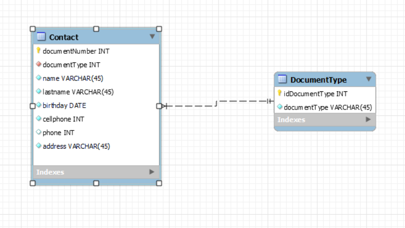

# Libreta de Contactos

En este documento mostrare la realización del proyecto de libreta de contactos como parte de la prueba técnica de la empresa, siendo esto entonces comienzo por:

### 1. Instalación

En el repositorio se encuentra un archivo .sql, el cual es el primer archivo que se debe de correr, utilizando cualquier motor sql a elección.

El segundo paso es crear un archivo .env con las credenciales de las base de datos, igual que la que se muestra en el ejemplo llamada ".env.example" que esta en la carpeta api.

Luego de ello se debe iniciar la  api, de esta forma:

```bash
cd ./api
npm i
npm start
```

Por ultimo, desde una nueva terminal inicializar la interfaz de usuario, de esta forma:

``` bash
cd ./vue-ui
npm i
npm run serve
```

De esta manera, todos los servicios necesarios se encontraran en funcionamiento.

<h3>2. Explicación del Proyecto </h3>

El diagrama de clases planteado para el proyecto es el siguiente:



Fuera de las opciones sugeridas en el documento, se le agrego la fecha de nacimiento de la persona, el numero dedocumento de identidad y el tipo de documento que tiene, a su vez se normalizo el valor de tipo de documento y se utilizo el numero de documento como llave primaria al ser un numero unico entre cada persona. A su vez, el planteamiento del modelo entidad relación fue el de cómo, todos al poseer un documento de identidad, tambien conocemos de que tipo es, sea cedula, tarjeta de identidad, pasaporte, etc.

Para finalizar, las pruebas de la API se realizaron a través de postman, y esta es la documentación de la misma: https://documenter.getpostman.com/view/21541456/2s8YeivEvb


Como nota final, se que hay ciertos fallos en la conexión entre la interfaz grafica y la API que no supe solucionar en el limite de tiempo, más me esforzare en que no sean cosas que sigan sucediendo en los mismos.


